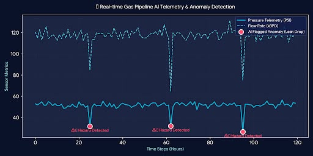

# ⚡ AI-Powered Energy & Gas Pipeline Anomaly Detector

<p align="center">
  
  
  
  
</p>

---

## 📌 Overview
This project demonstrates how unsupervised machine learning can be applied to simulated pipeline sensor data for anomaly detection. 

Using the **Isolation Forest** algorithm, the system evaluates generated telemetry data—including Pressure, Flow Rate, and Temperature—to identify potential operational anomalies such as simulated leaks, pressure drops, and thermal spikes.

---

## 🖥️ Application Demo & Visualizations

<p align="center">
  
</p>

---

## 📊 Data Source & Disclaimer
> **Note on Data Generation:**  
> To ensure continuous demonstration without relying on proprietary industrial telemetry, this project uses **synthetic data generated via Python NumPy standard normal distributions** (`np.random.normal`). Ground-truth anomaly labels are injected into the telemetry stream to rigorously evaluate model metrics.

---

## 📈 Model Performance & Evaluation
To validate detection capabilities beyond visual telemetry charts, synthetic hazard events were injected to benchmark the algorithm. 

> **Reproducibility Note:** The metrics below are computed dynamically by running `pipeline_ai_detector.py` with `seed=42` and `n_samples=200`:

| Metric | Benchmark Score | Evaluation Method |
| :--- | :--- | :--- |
| **Detection Accuracy** | **98.0%** | `sklearn.metrics.accuracy_score` |
| **Precision (Anomalies)** | **100.0%** | `sklearn.metrics.precision_score` |
| **Recall (Anomalies)** | **90.0%** | `sklearn.metrics.recall_score` |

To verify these exact figures locally, execute:
```bash
python pipeline_ai_detector.py
